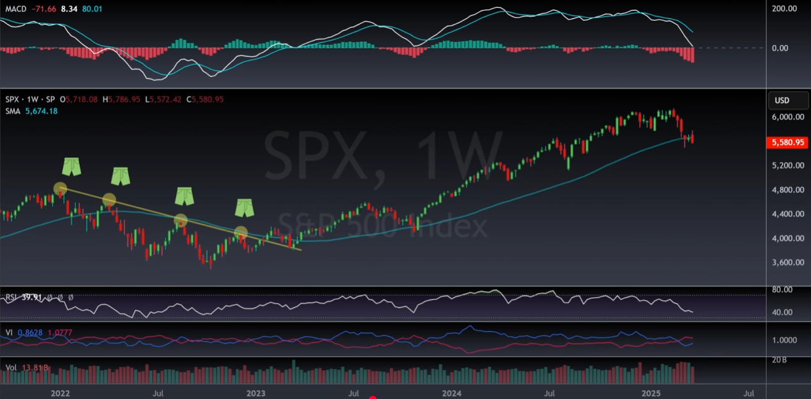
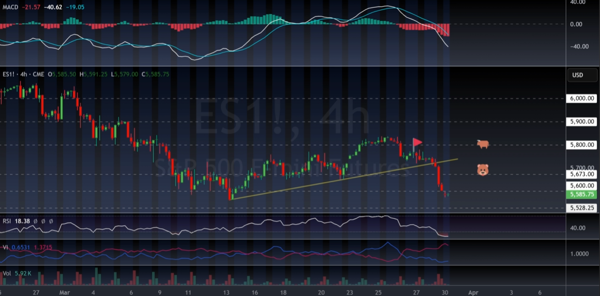
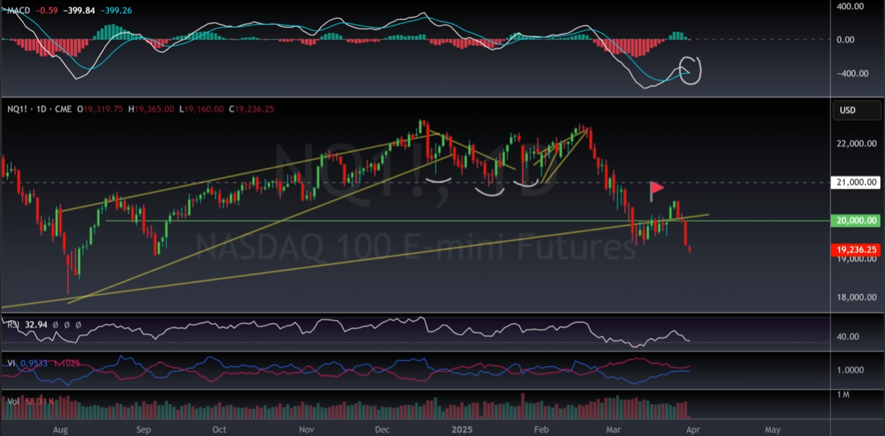

| Voting Machine                               | Weighing Machine                                                                                       |
| -------------------------------------------- | ------------------------------------------------------------------------------------------------------ |
| (Company / stock) Valuations don’t matter    | Valuations do matter                                                                                   |
| Upward trend                                 | Downward trend                                                                                         |
| The dumb sound smart The smart sound dumb | The dumb sound dumb The smart sound smart                                                           |
| Chase the momentum                           | Short the momentum, play defensive (change portfolio,  buy the boring stocks the produce cash flow) |
| ETFs > Individual Stocks                     | ETFs < Individual Stocks (because the turds in the ETF drag everything down)                           |

3 month Heatmap during a Weighing Machine 

3 month ETF Heatmap during a Weighting Machine

## Identifying the Market

- MACD crossing above the 0-line is the beginning of a bullish trend
	- the white line is the MACD, the blue line is the average
	- when the average crosses the 0 line, that is the signal
- SMA (SMA 50 → SMA 50 weeks moving average)
	- trading above the 50 weeks → bullish
	- trading below → bearish
	- SMA 200 days is also good, but 50 weeks is better

## Bullish Wave Strategy (Bull Market)

- You stay long, you buy calls
- You see the RSI getting overbought, you begin to hedge using put options for a week, two weeks, a month
- Use the dips as an opportunity to buy long position / calls, as long as you stay above the SMA 50w
- When there is a negative convergence in the RSI (and the MACD is moving down towards the zero line) you start selling the long positions

## Bear Wave Strategy (Bear Market)

- Trend of Resistance
- You short at the resistance touches, so long as we are below the zero line in the MACD & 50 week SMA
- How can you actually see the resistance trends? → 4h chart

- RSI becomes oversold (breaking through the lower boundaries)
- You hedge via buying calls for 1-2 weeks
- Use the peaks as an opportunity to buy short position / calls, as long as you stay below the SMA 50w

## Market Confirmations

### US Dollar 1d

- best chance for a market rebound is the rebound of the USD
- here: recession fear mentality is leading to a weakening in the overall market

### 10 Year Yield 1d

- 200 day SMA

### VIX (Volatility S&P 500 Index) 2h

### S&P 500 E-mini Futures 4h, 1D, 1W

### S&P 500 E-mini Futures 1w
with Bullinger Bands

- MACD already below zero → Bear Wave confirmation
- Violation of the Bullinger Bands 
	- sudden Flush-down is possible
	- But the RSI shows a possibility for sudden recovery and rebound
	- Last Low in the ES1! in last Summer at 5305.75 as resistance in case of flushdown
	- Which would be a -5.4% flush in one shot, then becomes oversold

### NASDAQ 100 E-Mini Futures 1D

- still in bear market (MACD below zero-line and shifting down again)
- BB can be extended down
- downward (extended) resistance (last big low from last summer) at 18.000

### SQQQ 1w

- the Inverse is now becoming bullish